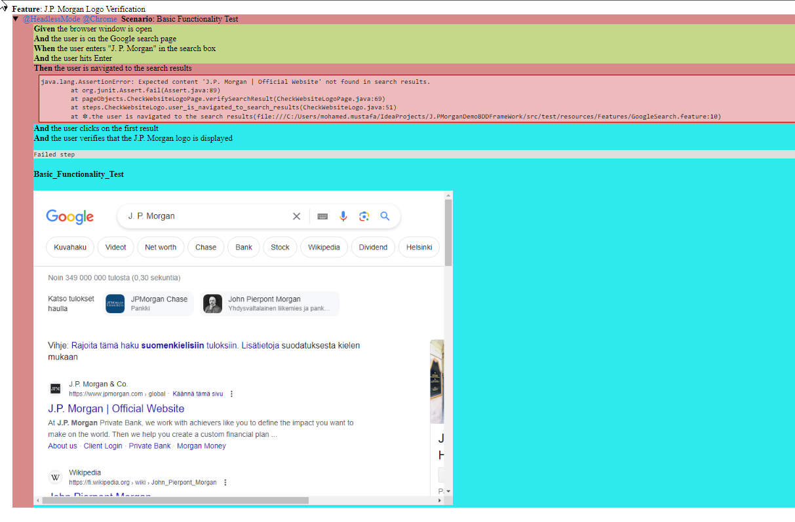
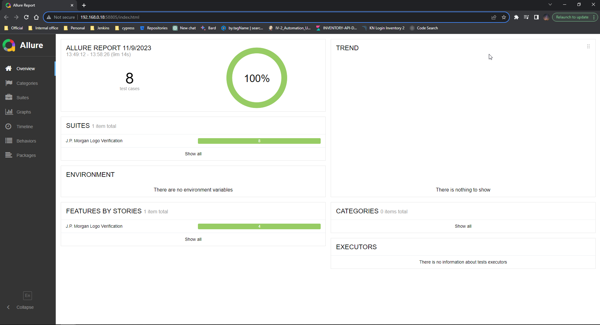

# Project Name
J.PMorgan Demo Project with BDD+Cucumber
selenium-cucumber : Automation Testing Using Java

selenium-cucumber is a behavior driven development (BDD) approach to write automation test script to test Web. It enables to write and execute automated acceptance/unit tests. It is cross-platform, open source and free. Automate test cases with minimal coding

## Table of Contents

- [Introduction](#introduction)
- [Prerequisites](#prerequisites)
- [Getting Started](#getting-started)
- [Project Structure](#project-structure)
- [Running Tests](#running-tests)
- [Reporting](#reporting)

## Introduction
This project is a demonstration of Behavior-Driven Development (BDD) using Cucumber, Java, and Maven. BDD is an agile software development methodology that encourages collaboration among developers, testers, and non-technical stakeholders to define and test application behavior in a common language that everyone can understand.

#### Key Components
Cucumber: Cucumber is a widely-used BDD framework that allows to write executable specifications using plain text and Gherkin syntax.

Java: Java is the programming language of choice for this project, providing the flexibility and robustness required for implementing BDD test automation.

Maven: Maven is used for project management and dependency resolution, simplifying the build and configuration process.

## Framework Architecture
--------------
    J.PMorganDemoBDDFrameWork
    |
    ├── src/test/java
    |   ├── hooks
    |   |   ├── Hooks.java
    |   |   ...
    |   ├── pageObjects
    |   |   ├── GoogleSearchPage
    |   |   ...
    |   ├── runners
    |   |   ├── TestRunner
    |   |   ...
    |   ├── steps
    |   |   ├── GoogleSearchSteps
    |   |   ...
    |
    ├── src/test/resources
    |   ├── drivers
    |   |   ├── chromedriver.exe
    |   |   ...
    |   ├── Features
    |   |   ├── GoogleSearch.feature
    |   |   ...

**hooks/Hooks** -- In `Hooks.java`, the browser is initialized before the test using the `@Before` hook, and it is closed after the test using the `@After` hook. Hooks ensure consistent test execution by offering a standardized approach to handle setup and teardown processes.

**pageObjects/GoogleSearchPage** --  They abstract the details of a web page, including its elements (e.g., buttons, text fields, links) and actions (e.g., clicking, entering text, verifying content).
Page Objects promote modularity and reusability by separating page-specific details from the test code.

**runners/TestRunner** -- The Runner class sets up the environment and triggers the execution of Cucumber scenarios, coordinating the interaction between feature files and step definitions.

**steps/GoogleSearchSteps** -- This is the landing page when the tests are triggered 

**drivers** -- This is where would store web driver executables or other driver-related resources.

**Features** -- Typically, this directory holds BDD feature files that define the behavior of tests.

## Description of tests (GoogleSearch.feature)
* Basic Functionality Test: This is a positive test to check if the J.P. Morgan logo is displayed after performing a Google search.
* Navigation and URL Verification: In this positive test, we verify that the URL to which we navigate is correct.
* Logo Placement Verification: This positive test ensures that the logo is correctly positioned on the page.
* Negative Testing - Invalid Search: In this negative test, we verify that invalid input should not display any results.

## Running-tests

* The scenario has the `@HeadlessMode` tag and configure the test to run in headless mode accordingly. Remove `@HeadlessMode` for normal run.
* `@Firefox` and `@Chrome` tags are used to select browser to run the tests
* Run tests from the command line using Maven. Open a terminal and navigate to project's root directory. Use the following command:
  `mvn clean install`
* Run tests from IDE. Most IDEs have built-in support for running Cucumber tests.  can run specific feature files, scenarios, or step definitions directly from the IDE.

## Reporting
* In tests  implemented multiple reports like (HTML reports,JSON reports, JUNIT Reports) , in base directory target folder
    * Logs are displayed in console with proper methods
        

            *HTML reports we can find the screenshot when tests are failed , we find the tests results in the reports
            *JSON reports generate proper JSON reports that can be integrated into other tools.
            *JUnit reports generate xml report for the running tests

* Failed test reports with screenshot attached in the reports (refer below screenshot)
        

* Configured allure reports for exact and fine report , to generate allure report navigate to the  base directory and use this command `allure serve allure-results`
        

## Resolved requirement
  * Quality of BDD Scenarios
      - Used clear and understandable language (Cucumber) that non-technical stakeholders can comprehend.
  * Quality of Test Coverage
      - Implemented scenarios that cover critical and high-risk areas of the application.
      - Edge cases and negative scenarios are added to improve test coverage.
  * Code Clarity and Maintainability
      - Well-structured, and modular code for step definitions.
      - Page object model for reusability 
      - Followed Java coding standards and best practices.
  * Design Patterns and Abstraction
      - Page Object Model (POM) to encapsulate interactions with web elements.
      - Step definitions and tests as abstract.
  * Ease of Determining Test Failure(s) Reason
      - Implemented meaningful assertions in step definitions to provide clear failure messages.
      - Implemented reporting functionality 
  * Dependency Management
      - Maven for dependency management to keep track of project dependencies.
      - Dependencies and their versions in `pom.xml` file.

## Appium testing
  * `@Mobile`  tag to run the same script in Appium, you will need to install the Appium server to execute the script. Additionally, please note that creating and running the test script is not compatible with my system (so this is the idea concept).