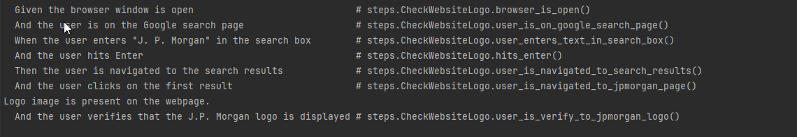

# Project Name
**J.P.Morgan Demo Project with BDD+Cucumber and Selenium**

## Overview
Welcome to the J.P. Morgan Demo Project, an automated testing solution using the Behavior-Driven Development (BDD) approach with Cucumber and Selenium. This project aims to comprehensively test critical functionalities such as opening Google, searching for "J. P. Morgan," clicking the first result, and verifying the presence of the J.P. Morgan logo. This README provides an overview of the project structure, key components, and instructions for running and reporting tests.

## Table of Contents
- [Introduction](#introduction)
- [Prerequisites](#prerequisites)
- [Getting Started](#getting-started)
- [Project Structure](#project-structure)
- [Running Tests](#running-tests)
- [Reporting](#reporting)

## Introduction
The J.P. Morgan Demo Project utilizes Selenium and Cucumber for BDD automation testing. The primary components include Cucumber for executable specifications, Java as the programming language, and Maven for project management. The framework follows a modular structure to ensure maintainability and ease of use.

### Key Components
- **Cucumber:** A BDD framework for writing executable specifications.
- **Java:** The chosen programming language for flexibility and robust test automation.
- **Maven:** Manages project dependencies and simplifies build and configuration processes.

## Framework Architecture
The project follows a structured framework with distinct components:

    
    J.PMorganDemoBDDFrameWork
    |
    ├── src/test/java
    |   ├── hooks
    |   |   ├── Hooks.java
    |   ├── pageObjects
    |   |   ├── GoogleSearchPage
    |   ├── runners
    |   |   ├── TestRunner
    |   ├── steps
    |   |   ├── GoogleSearchSteps
    |
    ├── src/test/resources
    |   ├── drivers
    |   |   ├── chromedriver.exe
    |   ├── Features
    |   |   ├── GoogleSearch.feature

**hooks/Hooks** -- In `Hooks.java`, the browser is initialized before the test using the `@Before` hook, and it is closed after the test using the `@After` hook. Hooks ensure consistent test execution by offering a standardized approach to handle setup and teardown processes.

**pageObjects/GoogleSearchPage** --  They abstract the details of a web page, including its elements (e.g., buttons, text fields, links) and actions (e.g., clicking, entering text, verifying content).
Page Objects promote modularity and reusability by separating page-specific details from the test code.

**runners/TestRunner** -- The Runner class sets up the environment and triggers the execution of Cucumber scenarios, coordinating the interaction between feature files and step definitions.

**steps/GoogleSearchSteps** -- This is the landing page when the tests are triggered 

**drivers** -- This is where would store web driver executables or other driver-related resources.

**Features** -- Typically, this directory holds BDD feature files that define the behavior of tests.

## Description of tests (GoogleSearch.feature)
* Basic Functionality Test: This is a positive test to check if the J.P. Morgan logo is displayed after performing a Google search.
* Navigation and URL Verification: In this positive test, we verify that the URL to which we navigate is correct.
* Logo Placement Verification: This positive test ensures that the logo is correctly positioned on the page.
* Negative Testing - Invalid Search: In this negative test, we verify that invalid input should not display any results.

## Running Tests
- Use `@HeadlessMode` tag to configure tests to run in headless mode. Remove for normal run.
- `@Firefox` and `@Chrome` tags select the browser for test execution.
- Run tests from the command line using Maven: `mvn clean install`.
- IDEs typically support running Cucumber tests directly.

## Reporting
* Multiple reports generated: HTML, JSON, and JUnit reports in the target directory.
* Console logs include proper methods for easy debugging.
        

            *HTML reports we can find the screenshot when tests are failed , we find the tests results in the reports
            *JSON reports generate proper JSON reports that can be integrated into other tools.
            *JUnit reports generate xml report for the running tests

* Screenshots in HTML reports highlight failed tests.
        

* Configured Allure reports for detailed analysis: `allure serve allure-results`.
        

## Resolved Requirements
- Quality of BDD Scenarios:
    - Clear and understandable language (Cucumber) for non-technical stakeholders.
- Quality of Test Coverage:
    - Covers critical areas, including edge cases and negative scenarios.
- Code Clarity and Maintainability:
    - Well-structured, modular code following Java coding standards.
    - Page Object Model (POM) for reusability.
- Design Patterns and Abstraction:
    - Implements Page Object Model (POM) for encapsulating interactions.
    - Abstract step definitions and tests.
- Ease of Determining Test Failure(s) Reason:
    - Meaningful assertions for clear failure messages.
    - Implemented reporting functionality.
- Dependency Management:
    - Maven for efficient dependency management in `pom.xml`.

## Appium Testing
- Use `@Mobile` tag for Appium testing. Note: Requires Appium server installation for execution.

